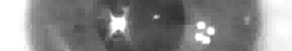
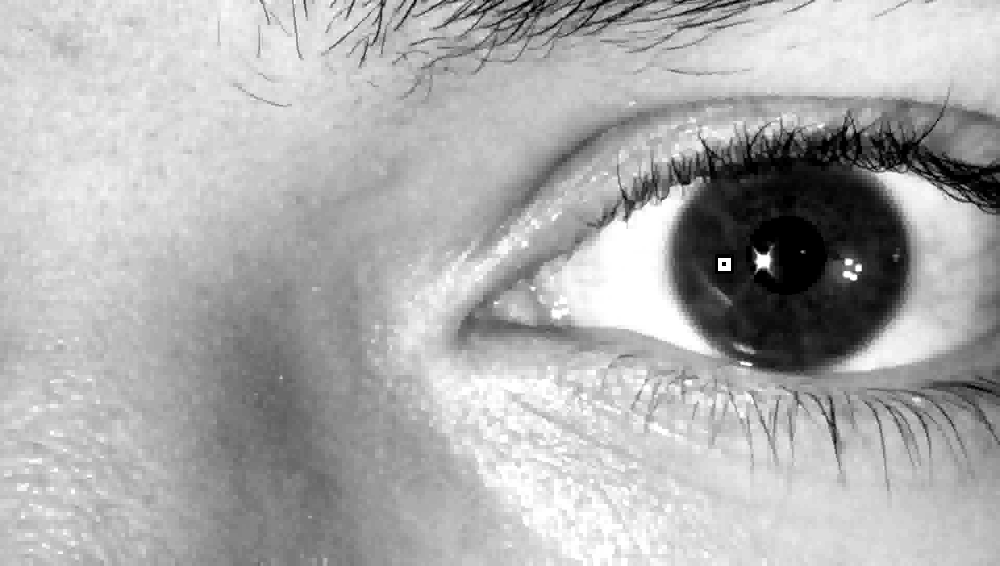
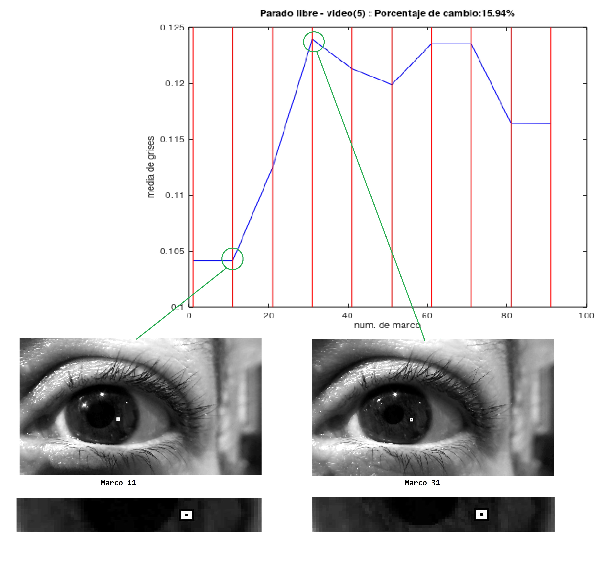
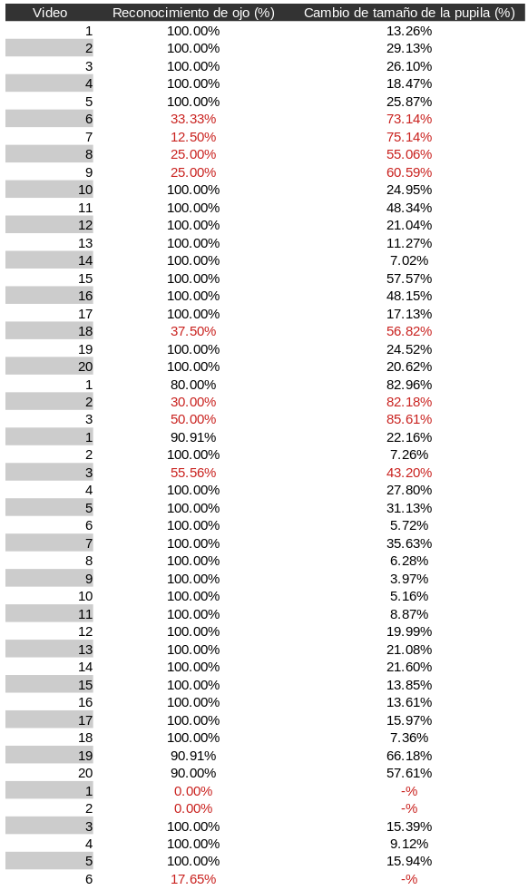

# Size percentage variation of the human pupil with Octave
## Controlled environment
Per project requirements, I set-up an environment where I could control some key variables:
  - Distance from the eye to the lens of the camera
  - Discrete amount of light that iluminates the frame (on/off)
  

  

In this kind of environment I took various videos in which the subjects would get iluminated to observe pupil contraction.

## Valid frames
Using the videos obtanied from the environment, to save on time and computing power, I checked for valid video-frames. I created a script that could recognize when the flash is on by checking the white-pixel average of each frame:

    

Since the pupil contracts non-instantaneously, I would save all the frames from that point until the flash turns off again, and then I can safely say that the pupil may contract in those frames.

## Eye recognition
Using the output frames from the last script, the next script tries to find the eyes, specifically the iris.
This script uses one (1) filter for all the videos in the a set. For example, the filter corresponding to the set "Lay-down and fixed" is this image:

    

For every video I read a frame, process the frame, and set up a marker (the little white and black square near the pupil) where the image best correlates with the filter (it's not necessary and even undesirable that the marker is in the exact middle of the pupil):

    

## Pupil size
After finding our marker, I walk a horizontal line across the pupil until it finds white again. Then, for every frame, I log the "blackness" of the image.
If the image is lighter, it means that the pupil has contracted:

    

## Efficacy
Every row corresponds a unique video. The numbering resets after each set of videos, each set has their own filter.

    

## All the images used are too heavy for GitHub. If you are interested in them, send me a mail to luis.nieto.pala@gmail.com
